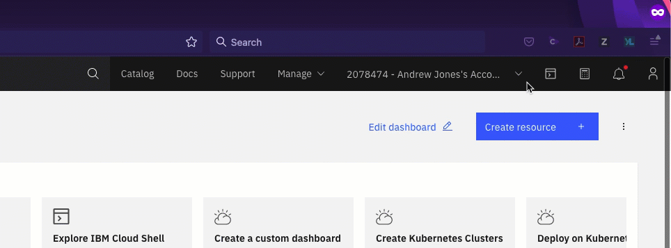
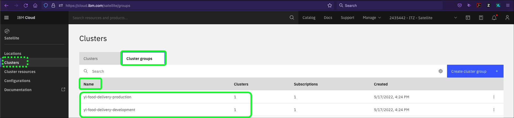

A cluster group specifies all Red Hat OpenShift on IBM Cloud clusters that you want to include in the deployment of your Kubernetes resources. You can learn more about creating cluster groups <a href="https://cloud.ibm.com/docs/satellite?topic=satellite-setup-clusters-satconfig#setup-clusters-satconfig-groups" target="_blank">here</a>.

For this demonstration, two cluster groups have already been created for you. This was a simple 2 step process of creating a Cluster Group name and adding one or more Red Hat OpenShift Clusters to the Cluster group.

The click-thru demonstration below allows you to walk through the process. Step by step instructions for this click-thru demonstration are not included as they are very basic.  If you are unsure where to click, click anywhere on the screen and click where the green highlight box appears.

   **Click-thru demo:** <a href="https://ibm.github.io/SalesEnablement-Satellite-L3-Sales/includes/createClusterGroups/index.html" target ="_blank">Create Satellite Cluster Groups</a>

Next, in the steps below, use the IBM Cloud Portal and your IBM Tech Zone environment to  verify that the cluster groups have been created and each has an assigned cluster.

1. Open the IBM Cloud portal to the Satellite-Clusters page:
  <a href="https://cloud.ibm.com/satellite/clusters" target="_blank">https://cloud.ibm.com/satellite/clusters</a>

2. If you haven't already, change from your IBM Cloud account to the **{{ account }}** account.

!!! tip
    If your browser window is narrow, you may see this icon:  instead of the current account name as shown in the screen capture above.

3. Click the **Cluster groups** tab.

4. Verify the **{{ appdeployment.dev_cluster_group }}** and **{{ appdeployment.dev_cluster_group }}** groups exist and each has 1 cluster assigned.

!!! note

    There may be other **cluster groups** listed. Click the **Name** heading in the table to bring the **{{ appdeployment.dev_cluster_group }}** and **{{ appdeployment.dev_cluster_group }}** groups to the top of the table.

