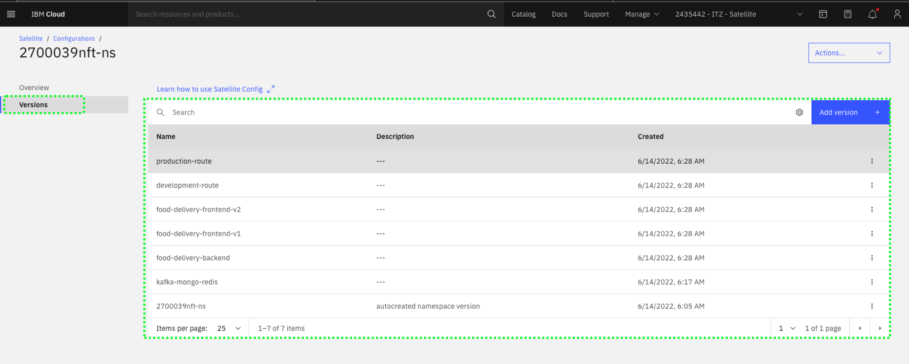

Command Line Interfaces (CLIs) are available for IBM Cloud Satellite. In this section, explore the CLI capabilities related to IBM Cloud Satellite Locations. You can learn more about all the IBM Cloud Satellite CLIs <a href="https://cloud.ibm.com/docs/satellite?topic=satellite-satellite-cli-reference" target="_blank">here</a>. When doing client demonstrations, it is important to understand who is in your audience. Performing demonstrations of CLIs to a Chief Technology Officer (CTO) or Chief Information Officer (CIO) may not be well received; however, this type of demonstration may resonate well with other audiences like members of the IT staff, line-of-business developers, and others. These audiences will want to know that CLIs exist to perform the IBM Cloud Satellite tasks as they will probably want to further automate them in their deployments.

# Overview of IBM Cloud Satellite CLIs

In this part of the demonstration, you will use the IBM Cloud Shell. If you are not familiar with IBM Cloud Shell, you can learn about it <a href="https://cloud.ibm.com/docs/cloud-shell?topic=cloud-shell-getting-started" target="_blank">here</a>.

!!! tip
    Use the **copy** capability of the demonstration guide to copy and paste commands to the IBM Cloud Command Shell to avoid typing errors.

1. In the IBM Cloud Portal, with the demonstration account selected (**{{ account }}**), click the IBM Cloud Shell icon.


The IBM Cloud Shell will open in a new browser tab or window. It may take a few seconds for the shell to initialize.


2. Synchronize the IBM Cloud portal Identity and Access Management (IAM) permissions with the Role-based access controls (RBAC) for the IBM Cloud Satellite Location's OpenShift cluster.


!!! important "Important"

    **Do not skip this exercise.  If you do not complete this step later parts of the demonstration script are likely to fail.**

```
ibmcloud ks cluster config --cluster {{ aws.cluster_id }}
```

??? example "Example output"
    OK

    The configuration for {{ aws.cluster_id }} was downloaded successfully.

    Added context for {{ aws.cluster_id }} to the current kubeconfig file.
    You can now execute 'kubectl' commands against your cluster. For example, run 'kubectl get nodes'.
    If you are accessing the cluster for the first time, 'kubectl' commands might fail for a few seconds while RBAC synchronizes.

!!! info "Important"
    The above command forces the RBAC to be synchronized between IBM Cloud and the Red Hat OpenShift cluster running in the IBM Cloud Satellite Location. If this command is not run, issues may be encountered later in this demonstration.


3. List the IBM Cloud Satellite Locations.

```
ibmcloud sat locations
```

??? example "Example output"
     Retrieving locations...

     OK

     Name            ID                     Status   Ready   Created     Hosts (used/total)   Managed From

     yl-l3-aws                       cad1ulgw093e0708rkt0   normal            yes     4 days ago     12 / 12              wdc

4. Get the details for a specific IBM Cloud Satellite Location.

```
ibmcloud sat location get --location {{ aws.location }}
```

??? example "Example output"
     Retrieving location...

     OK

     Name:                           yl-l3-aws

     ID:                             cad1ulgw093e0708rkt0

     Created:                        2022-06-03 14:48:54 +0000 (4 days ago)

     Managed From:                   wdc

     State:                          normal

     Ready for deployments:          yes

     Message:                        R0001: The Satellite location is ready for operations.

     Hosts Available:                0

     Hosts Total:                    12

     Host Zones:                     us-east-2a, us-east-2b, us-east-2c

     Provider:                       aws

     Provider Region:                us-east-2

     Provider Credentials:           yes

     Public Service Endpoint URL:    https://c107.us-east.satellite.cloud.ibm.com:31117

     Private Service Endpoint URL:   -

     OpenVPN Server Port:            -

     Ignition Server Port:           -

     Konnectivity Server Port:       30696

     Logging Key Set:                no

     Activity Tracker Key Set:       no

5. Get a list of the hosts associated with a specific IBM Cloud Satellite Location.

```
 ibmcloud sat hosts --location {{ aws.location }}
```

??? example "Example output"
     Retrieving hosts...

     OK

     Name            ID                     State      Status   Zone         Cluster          Worker             ID                                                Worker IP

     ip-10-0-1-107   289f4f6e3d1a3c42d29d   assigned   Ready    us-east-2a   yl-l3-aws-roks-1   sat-ip1001107-1ee31562dda0bcd519bc8beea3614836eb83fe18   10.0.1.107

     ip-10-0-1-14    0b831f71a8d326ee90b8   assigned   Ready    us-east-2a   yl-l3-aws-roks-1   sat-ip100114-25b1fbbb379b638dde07d7de5f7ee1c6709713f5    10.0.1.14

     ip-10-0-1-226   b4442548c25c1433d7e5   assigned   Ready    us-east-2a   infrastructure     sat-ip1001226-bb043735a3c21665c2b594f06a9c92685a491887   10.0.1.226
     ip-10-0-1-4     22c2a1b04aff873c9f04   assigned   Ready    us-east-2a   yl-l3-aws-roks-1   sat-ip10014-8d8549797efbe24b18cbad62ec223b2ce976ddac     10.0.1.4

     ip-10-0-2-140   bb98074e3ec369933b25   assigned   Ready    us-east-2b   infrastructure     sat-ip1002140-e63e7ac9df2602fc91be1372cc7052e934f4cf23   10.0.2.140

     ip-10-0-2-15    7bc6a0ae9f52e9f49361   assigned   Ready    us-east-2b   yl-l3-aws-roks-1   sat-ip100215-6d04589925c7dd655ab18ed8a8f2199295271328    10.0.2.15

     ip-10-0-2-168   ff15fc49a3c753607e57   assigned   Ready    us-east-2b   yl-l3-aws-roks-1   sat-ip1002168-05ea71e250a4d2ee101f2a4487323dc5a126da20   10.0.2.168

     ip-10-0-2-71    5c64f7f1e532d60dd221   assigned   Ready    us-east-2b   yl-l3-aws-roks-1   sat-ip100271-5c0a3c15c3326535b07a0679e16a30977e5b8bc9    10.0.2.71

     ip-10-0-3-111   b9b8a67a1b6ca33671cc   assigned   Ready    us-east-2c   infrastructure     sat-ip1003111-ce17f52dba844e500fdca4a10a05b5a02ab66cc3   10.0.3.111

     ip-10-0-3-122   f03bbefa2b076dea98f4   assigned   Ready    us-east-2c   yl-l3-aws-roks-1   sat-ip1003122-f8db0228dc7bfa4e0cae336381badada5fd96978   10.0.3.122

     ip-10-0-3-18    fd4035666c40c463e156   assigned   Ready    us-east-2c   yl-l3-aws-roks-1   sat-ip100318-9fecf3e6ff050f8c5e934e974610440d82572360    10.0.3.18

     ip-10-0-3-230   5d6fbf6d5440d636743f   assigned   Ready    us-east-2c   yl-l3-aws-roks-1   sat-ip1003230-95ff4fb6c3c07fc19652f42e8bfa6a6284a78451   10.0.3.230


??? failure "If this fails"
    Occasionally, the above command may time out with a "FAILED: Could not complete request" message.  Try running the command again.

6. Get the details for a specific host.

!!! tip
    You may need to replace the string **{{ aws.host_ip }}** with the name of one of the hosts from the previous command.

```copycommand
ibmcloud sat host get --location {{ aws.location }} --host {{ aws.host_ip }}
```

??? example "Example output"
    Retrieving host details...

    Name:     ip-10-0-1-107

    ID:       289f4f6e3d1a3c42d29d

    State:    assigned

    Status:   Ready

    Zone:     us-east-2a


    Labels

    memory     15963132

    os         RHEL7

    provider   aws

    zone       us-east-2a

    cpu        4

    env        prod


    Assignment

    Cluster:       yl-l3-aws-roks-1

    Worker Pool:   default

    Worker ID:     sat-ip1001107-1ee31562dda0bcd519bc8beea3614836eb83fe18

    Worker IP:     10.0.1.107

    OK


All the commands executed above are commands that list or view the details of an IBM Cloud Satellite object. There are also commands to create, remove, and modify these objects. In this demonstration environment, you do **not** have permissions to add, remove or change Locations or Hosts.

# Create **Versions** for the Food Delivery application

Now that you are familiar with the CLIs for IBM Cloud Satellite, you can create the other 5 **versions** for our demonstration.  The CLI syntax to create a version is:

   ibmcloud sat config version create --config CONFIG --file-format FORMAT --name NAME --read-config CONFIG [--description DESCRIPTION] [-q]


The parameters are:

   --name value         The name of the Satellite configuration version.

   --config value       The name or ID of the Satellite configuration.

   --file-format        The file format of the configuration version. Available options: yaml

   --description value  Description for the Satellite configuration version.

   -read-config value  The file path for the configuration version file.

   -q                   Do not show the message of the day or update reminders.


To save time and prevent typographical errors, an automated script has been created for you. The script is interactive and will display all the command lines as they are executed. The script will do the following:

- Download all the YAML files that will be used for the **versions**.
- Update the YAML files with your unique Satellite **configuration** and **project/namespace** in the OpenShift clusters.
- Create the remaining 5 versions required for the Food Delivery application.

7. Download the automated script:

```
wget https://raw.githubusercontent.com/IBM/SalesEnablement-Satellite-L3-Sales/main/tools/createVersions.bash
```

??? example "Example output"

    --2022-05-31 15:19:50--  https://raw.githubusercontent.com/IBM/SalesEnablement-Satellite-L3-Sales/main/tools/createVersions.bash

    Resolving raw.githubusercontent.com (raw.githubusercontent.com)... 185.199.108.133, 185.199.110.133, 185.199.109.133, ...

    Connecting to raw.githubusercontent.com (raw.githubusercontent.com)|185.199.108.133|:443... connected.
    HTTP request sent, awaiting response... 200 OK

    Length: 12725 (12K) [text/plain]

    Saving to: ‘createVersions.bash’

    createVersions.bash                                 100%[==================================================================================================================>]  12.43K  --.-KB/s    in 0.001s

    2022-05-31 15:19:50 (14.1 MB/s) - ‘createVersions.bash’ saved [12725/12725]


8. Change the permissions of the script so it can execute:

```
chmod +x createVersions.bash
```

9. Run the script and when prompted, enter **y** for yes:

```
./createVersions.bash
```

??? example "Example output"

    Retrieving your IBM Cloud Unique ID using command: ibmcloud account user-preference

    Do you want to retrieve all the YAML files from the git repository (https://raw.githubusercontent.com/IBM/SalesEnablement-Satellite-L3/main) (y|n)? y

    Retrieving food-delivery-backendfood-delivery-backend.yaml                          100%[==================================================================================================================>]   5.21K  --.-KB/s    in 0.001s

    Retrieving food-delivery-frontend-v1

    food-delivery-frontend-v1.yaml                      100%[==================================================================================================================>]     746  --.-KB/s    in 0s

    Retrieving food-delivery-frontend-v2

    food-delivery-frontend-v2.yaml                      100%[==================================================================================================================>]     746  --.-KB/s    in 0s

    Retrieving development-route

    development-route.yaml                              100%[==================================================================================================================>]   2.39K  --.-KB/s    in 0s

    Retrieving production-route

    production-route.yaml                               100%[==================================================================================================================>]   2.39K  --.-KB/s    in 0s

    get mkdocs.yml

    mkdocs.yml                                          100%[==================================================================================================================>]   4.43K  --.-KB/s    in 0.001s


    Verify your configuration exists (y|n)? y

    2700039nft-ns configuration exists - UUID = 5208ee8e-75d0-4309-bb0a-c7f38bdee363

    Substitute all placeholders in YAML files (y|n)? y

    Updating food-delivery-backend.yaml

    Updating food-delivery-frontend-v1.yaml

    Updating food-delivery-frontend-v2.yaml

    Updating development-route.yaml

    Updating production-route.yaml


    Do you want to create the versions in your configuration (y|n)? y

    Creating version food-delivery-backend using food-delivery-backend.yaml:

                ibmcloud sat config version create -name food-delivery-backend --read-config food-delivery-backend.yaml --config 5208ee8e-75d0-4309-bb0a-c7f38bdee363 --file-format yaml

    Creating configuration version...

    OK

    Configuration Version food-delivery-backend was successfully created with ID f25371c1-4bbb-4ada-9d85-a1a0fd5449f2.


    Creating version food-delivery-frontend-v1 using food-delivery-frontend-v1.yaml:

                ibmcloud sat config version create -name food-delivery-frontend-v1 --read-config food-delivery-frontend-v1.yaml --config 5208ee8e-75d0-4309-bb0a-c7f38bdee363 --file-format yaml

    Creating configuration version...

    OK

    Configuration Version food-delivery-frontend-v1 was successfully created with ID dd1e8a5e-2076-4237-b03c-520c38802db5.


    Creating version food-delivery-frontend-v2 using food-delivery-frontend-v2.yaml:

                ibmcloud sat config version create -name food-delivery-frontend-v2 --read-config food-delivery-frontend-v2.yaml --config 5208ee8e-75d0-4309-bb0a-c7f38bdee363 --file-format yaml

    Creating configuration version...

    OK

    Configuration Version food-delivery-frontend-v2 was successfully created with ID f586d528-7090-40c4-9cbb-81ff5eca98fe.


    Creating version development-route using development-route.yaml:

                ibmcloud sat config version create -name development-route --read-config development-route.yaml --config 5208ee8e-75d0-4309-bb0a-c7f38bdee363 --file-format yaml

    Creating configuration version...

    OK

    Configuration Version development-route was successfully created with ID 688010c9-6d54-4800-8f47-542608cfde77.


    Creating version production-route using production-route.yaml:

                ibmcloud sat config version create -name production-route --read-config production-route.yaml --config 5208ee8e-75d0-4309-bb0a-c7f38bdee363 --file-format yaml

    Creating configuration version...

    OK

    Configuration Version production-route was successfully created with ID dd73466a-7d81-44fa-af44-e56332ba4fae.


    Do you want to remove temporary files (y|n)? y

Now that the script has executed, return to the IBM Cloud Portal and verify all 6 versions now exist. You should also explore the YAML files that are used by each subscription. Return to your **Satellite configuration** in the IBM Cloud Portal and examine the **versions** that have been created. You should see a total of seven versions. The six that you created:

   - kafka-mongo-redis
   - food-delivery-backend
   - food-Delivery-frontend-v1
   - food-delivery-frontend-v2
   - development-route
   - production-route


