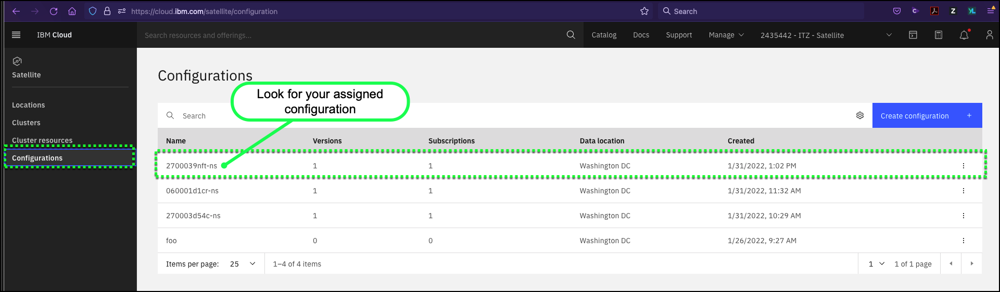
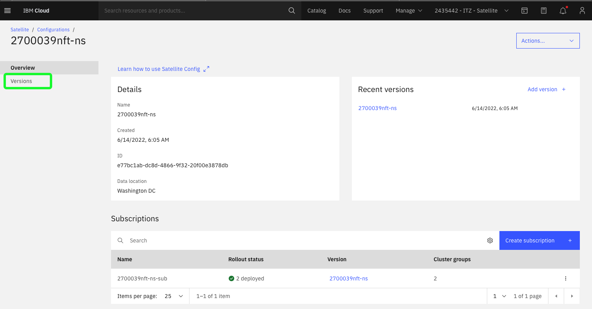
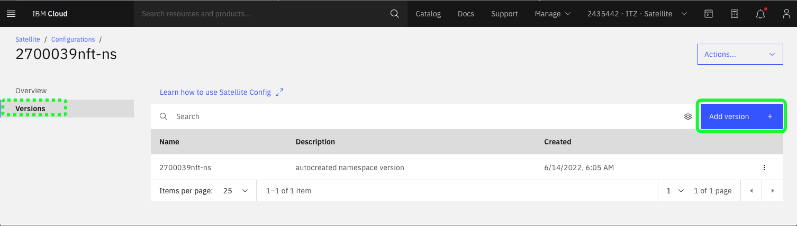
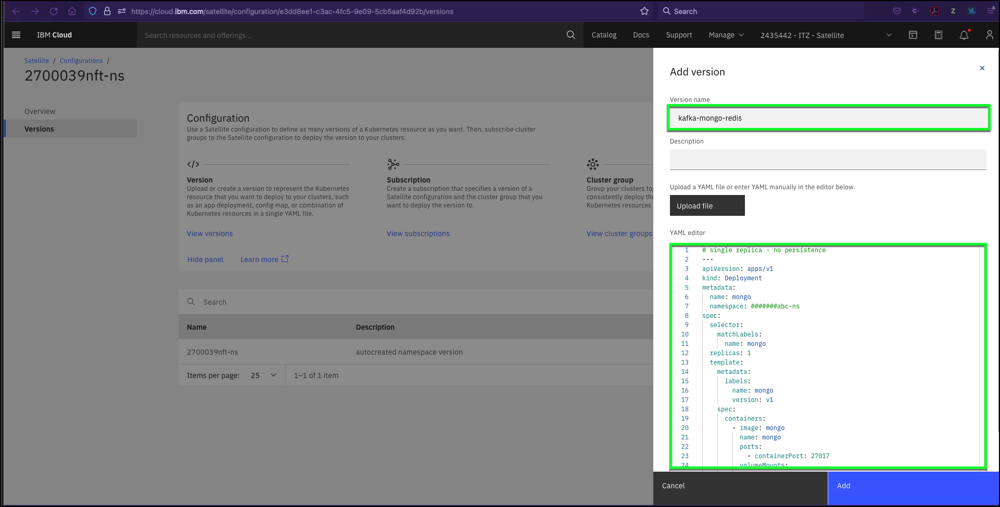

Now that the **configuration** has been created for you, the next step is to create **versions** for each part of the Food Delivery application. In this example, the YAML files used will create OpenShift deployments and routes in the namespace that has been created for you in the respective OpenShift clusters. Four **deployment** versions will be created: two for the backend services of the application and two different frontends. These **deployments** will deploy the Kubernetes containers that include the container images and application code. **Versions** will also be created for the development (dev) and production (prod) environments that will define **routes**. Routes are used in OpenShift to define communication paths between the end user and the frontend of the application, as well as from the frontend to the backend, and backend to the various backend data stores.

Almost all IBM Cloud capabilities can be performed using the IBM Cloud Portal, command line interfaces (CLIs), and application programming interfaces (APIs). In this demonstration, you will use two of these methods to create the **versions**. First, you will use the IBM Cloud Portal to create the first **version** that will deploy the backend database (Mongo and Redis) and event stream system (Kafka). Next, you will use the IBM Cloud command line interfaces (CLIs) to create the **versions** for the backend mirco-services, frontends applications, and the network routes that hook all the components together.

1. If you closed the IBM Cloud portal after the previous step, open the IBM Cloud portal to the Satellite Configurations page: <a href="https://cloud.ibm.com/satellite/configuration" target="_blank">https://cloud.ibm.com/satellite/configuration</a>.

2. Click the **configuration** based on your **{{ tz_environment.uuid_label }}**.



3. Click the **Versions** link in left hand menu.

!!! warning
    Notice, one **Version** already exists in your configuration. This **Version** was used to create the OpenShift project where you will be deploying the application. Do **NOT** delete any existing versions or subscriptions! Deleting them will break your demonstration environment.



4. Click **Add version +**.



5. Create a **version** called **kafka-mongo-redis**.

!!! info "Important"
    Do NOT click the **Add** button until AFTER you complete step 6!!!

For the Version name, use:

```
kafka-mongo-redis
```
!!! tip
    To save time, use click the  icon in the sections below to copy the text to your clipboard and then paste the text into the IBM Cloud portal as directed.

Optionally, enter a description in the **Description** field.

Copy and paste the following YAML code into the **YAML editor**.

``` yaml title="kafka-mongo-redis.yaml"
# single replica - no persistence
---
apiVersion: apps/v1
kind: Deployment
metadata:
  name: mongo
  namespace: {{ tz_environment.uuid_label }}
spec:
  selector:
    matchLabels:
      name: mongo
  replicas: 1
  template:
    metadata:
      labels:
        name: mongo
        version: v1
    spec:
      containers:
        - image: mongo
          name: mongo
          ports:
            - containerPort: 27017
          volumeMounts:
            - mountPath: /data/db
              name: data
      volumes:
      - name: data
        emptyDir: {}
---
apiVersion: v1
kind: Service
metadata:
  name: mongo
  namespace: {{ tz_environment.uuid_label }}
spec:
  ports:
    - port: 27017
      targetPort: 27017
  selector:
    name: mongo
# no persistence
---
apiVersion: apps/v1
kind: Deployment
metadata:
  name: redis
  namespace: {{ tz_environment.uuid_label }}
spec:
  selector:
    matchLabels:
      name: redis
  replicas: 1
  template:
    metadata:
      labels:
        name: redis
        version: v1
    spec:
      containers:
        - image: redis
          name: redis
          ports:
            - containerPort: 6379
          volumeMounts:
            - mountPath: /data
              name: data
      volumes:
      - name: data
        emptyDir: {}
---
apiVersion: v1
kind: Service
metadata:
  name: redis
  namespace: {{ tz_environment.uuid_label }}
spec:
  ports:
    - port: 6379
      targetPort: 6379
  selector:
    name: redis
---
apiVersion: v1
kind: Service
metadata:
  name: kafka
  namespace: {{ tz_environment.uuid_label }}
spec:
  ports:
    - port: 9092
      protocol: TCP
      targetPort: 9092
  selector:
    name: kafka
---
apiVersion: apps/v1
kind: Deployment
metadata:
  name: kafka
  namespace: {{ tz_environment.uuid_label }}
spec:
  selector:
    matchLabels:
      name: kafka
  template:
    metadata:
      labels:
        name: kafka
    spec:
      containers:
      - image: bitnami/zookeeper:3.6.3
        name: zookeeper
        env:
        - name: ALLOW_ANONYMOUS_LOGIN
          value: 'yes'
        ports:
        - containerPort: 2181
          name: zookeeper
      - image: bitnami/kafka:2.8.0
        name: kafka
        env:
        - name: KAFKA_BROKER_ID
          value: '1'
        - name: KAFKA_CFG_LISTENERS
          value: 'PLAINTEXT://:9092'
        - name: KAFKA_CFG_ADVERTISED_LISTENERS
          value: 'PLAINTEXT://kafka:9092'
        - name: KAFKA_CFG_ZOOKEEPER_CONNECT
          value: 'localhost:2181'
        - name: ALLOW_PLAINTEXT_LISTENER
          value: 'yes'
        ports:
        - containerPort: 9092
          name: kafka
```



6. Search and replace all instances of **{{ tz_environment.uuid_label }}** with your unique **{{ tz_environment.uuid_label }}**.

The YAML editor in the IBM Cloud portal has a **search and replace** function. Type ++ctrl++**+f** or ++cmd++**+f** (this will vary depending on your computers operating system). Expand the dialog by clicking the  icon next to the entry field. In the first entry field, enter **{{ tz_environment.uuid_label }}**. In the second entry field, enter your unique **{{ tz_environment.uuid_label }}**. The dialog should update with a **"1 of 6"** message. Click the **replace all**  icon to make the changes.


7. Click **Add**.

??? failure "Is the **Add** button not enabled?"
    If the **Add** button isn't enabled, there is a problem with your YAML. YAML is very sensitive to formatting. Make sure you cut & paste the YAML instead of entering it manually.

--------------

Now that we have created a **version** using the IBM Cloud Portal, lets create the other **versions** using the IBM Cloud command line interfaces.  This will save time and illustrate how most clients will automate these steps.

Command Line Interfaces (CLIs) are available for IBM Cloud Satellite. In this section, explore the CLI capabilities related to IBM Cloud Satellite Locations. You can learn more about all the IBM Cloud Satellite CLIs <a href="https://cloud.ibm.com/docs/satellite?topic=satellite-satellite-cli-reference" target="_blank">here</a>. When doing client demonstrations, it is important to understand who is in your audience. Performing demonstrations of CLIs to a Chief Technology Officer (CTO) or Chief Information Officer (CIO) may not be well received; however, this type of demonstration may resonate well with other audiences like members of the IT staff, line-of-business developers, and others. These audiences will want to know that CLIs exist to perform the IBM Cloud Satellite tasks as they will probably want to further automate them in their deployments.

In this part of the demonstration, you will use the IBM Cloud Shell. If you are not familiar with IBM Cloud Shell, you can learn about it <a href="https://cloud.ibm.com/docs/cloud-shell?topic=cloud-shell-getting-started" target="_blank">here</a>.

!!! tip
    Use the **copy** capability of the demonstration guide to copy and paste commands to the IBM Cloud Command Shell to avoid typing errors.

1. In the IBM Cloud Portal, with the demonstration account selected (**{{ account }}**), click the IBM Cloud Shell icon.


The IBM Cloud Shell will open in a new browser tab or window. It may take a few seconds for the shell to initialize.


2. Synchronize the Role-based access controls (RBAC) for the IBM Cloud Satellite Location's OpenShift cluster.


!!! important "Important"

    **Do not skip this exercise.  If you do not complete Step 2 below later parts of the demonstration script are likely to fail.**

```
ibmcloud ks cluster config --cluster {{ aws.cluster_id }}
```

??? example "Example output"
    OK

    The configuration for {{ aws.cluster_id }} was downloaded successfully.

    Added context for {{ aws.cluster_id }} to the current kubeconfig file.
    You can now execute 'kubectl' commands against your cluster. For example, run 'kubectl get nodes'.
    If you are accessing the cluster for the first time, 'kubectl' commands might fail for a few seconds while RBAC synchronizes.

!!! info "Important"
    The above command forces the RBAC to be synchronized between IBM Cloud and the Red Hat OpenShift cluster running in the IBM Cloud Satellite Location. If this command is not run, issues may be encountered later in this demonstration.


3. List the IBM Cloud Satellite Locations.

```
ibmcloud sat locations
```

??? example "Example output"
    Retrieving locations...

    OK

    Name            ID                     Status   Ready   Created     Hosts (used/total)   Managed From

    aws-us-east-2   c7o2a02w03bj8394o9ng   normal   yes     1 day ago   12 / 12              wdc

4. Get the details for a specific IBM Cloud Satellite Location.

```
ibmcloud sat location get --location {{ aws.location }}
```

??? example "Example output"
    Retrieving location...

    OK

    Name:                           aws-us-east-2

    ID:                             c7o2a02w03bj8394o9ng

    Created:                        2022-01-25 16:27:44 +0000 (1 day ago)

    Managed From:                   wdc

    State:                          normal

    Ready for deployments:          yes

    Message:                        R0001: The Satellite location is ready for operations.

    Hosts Available:                0

    Hosts Total:                    12

    Host Zones:                     us-east-2a, us-east-2b, us-east-2c

    Public Service Endpoint URL:    https://c117.us-east.satellite.cloud.ibm.com:30051

    Private Service Endpoint URL:   -

    OpenVPN Server Port:            32196

    Ignition Server Port:           -

    Konnectivity Server Port:       -

5. Get a list of the hosts associated with a specific IBM Cloud Satellite Location.

```
 ibmcloud sat hosts --location {{ aws.location }}
```

??? example "Example output"
    Retrieving hosts...

    OK

    Name            ID                     State      Status   Zone         Cluster          Worker
    ID                                                Worker IP

    ip-10-0-1-114   b7f18e883cd88cace8d7   assigned   Ready    us-east-2a   aws-os-cluster   sat-ip1001114-df552aab5e6958f69e3e2004ff8de9e21e941cdf   10.0.1.114

    ip-10-0-1-250   e30ad9324972c7197d8b   assigned   Ready    us-east-2a   aws-os-cluster   sat-ip1001250-4a2ea8e29c0222974e39d954a4e20f26b7ee702a   10.0.1.250

    ip-10-0-1-51    31ce10f9188d8f39f498   assigned   Ready    us-east-2a   aws-os-cluster   sat-ip100151-7fe9c382d5b86bd3de7113f65189bcbf5c720ab3    10.0.1.51

    ip-10-0-1-80    d22325e1dc4741fd12f2   assigned   Ready    us-east-2a   infrastructure   sat-ip100180-9506c0d50c1faf25ebdee971cd8fb04b03a85f46    10.0.1.80

    ip-10-0-2-179   c092b543a00d50b93890   assigned   Ready    us-east-2b   aws-os-cluster   sat-ip1002179-f4a6bd55983e7e0a8d1071b073dd7bdc983d3f80   10.0.2.179

    ip-10-0-2-4     3839f171b846beb1c1e9   assigned   Ready    us-east-2b   aws-os-cluster   sat-ip10024-2dd947a2bfbbbc129e2c1b618c0e135481ac44b8     10.0.2.4

    ip-10-0-2-49    58a414bd88d303fca850   assigned   Ready    us-east-2b   aws-os-cluster   sat-ip100249-4394d34dc43811c985e6211df97abe31472a8a69    10.0.2.49

    ip-10-0-2-92    ba5337e855ee8b94477f   assigned   Ready    us-east-2b   infrastructure   sat-ip100292-92e16bb3dffb35810fd8fe8a5003abf1745adf81    10.0.2.92

    ip-10-0-3-101   a2650ddf093fbb8b70bc   assigned   Ready    us-east-2c   aws-os-cluster   sat-ip1003101-2584aa634011ba4d8a0f57986f4f6f087fa895cf   10.0.3.101

    ip-10-0-3-111   6dab45fb390d80f5c4d2   assigned   Ready    us-east-2c   aws-os-cluster   sat-ip1003111-5c9a519ad61010c17548c540a510d738f296d975   10.0.3.111

    ip-10-0-3-157   f00f81d01b6860e050df   assigned   Ready    us-east-2c   infrastructure   sat-ip1003157-62a198744fdd0577ea0640a816f8a2f35d2a2198   10.0.3.157

    ip-10-0-3-63    4a856f18f177ffc014eb   assigned   Ready    us-east-2c   aws-os-cluster   sat-ip100363-6bcb834add6d924ce2a0a0772835ae8794497162    10.0.3.63

??? failure "If this fails"
    Occasionally, the above command may time out with a "FAILED: Could not complete request" message.  Try running the command again.

6. Get the details for a specific host.

!!! tip
    You may need to replace the string **{{ aws.host_ip }}** with the name of one of the hosts from the previous command.

```copycommand
ibmcloud sat host get --location {{ aws.location }} --host {{ aws.host_ip }}
```

??? example "Example output"
    Retrieving host details...

    Name:     ip-10-0-1-114

    ID:       b7f18e883cd88cace8d7

    State:    assigned

    Status:   Ready

    Zone:     us-east-2a

    Labels

    cpu      4

    env      prod

    memory   15963200

    os       RHEL7

    zone     us-east-2a

    Assignment

    Cluster:       aws-os-cluster

    Worker Pool:   default

    Worker ID:     sat-ip1001114-df552aab5e6958f69e3e2004ff8de9e21e941cdf

    Worker IP:     10.0.1.114

    Date:          21 hours ago

    OK

All the commands executed above are commands that list or view the details of an IBM Cloud Satellite object. There are also commands to create, remove, and modify these objects. In this demonstration environment, you do **not** have permissions to add, remove or change Locations or Hosts.

Now that you have seen some of the related CLIs for IBM Cloud Satellite, lets create the other **versions** for our demonstration.  The CLI to create a version is:

```
ibmcloud sat config version create --config CONFIG --file-format FORMAT --name NAME --read-config CONFIG [--description DESCRIPTION] [-q]
```

The parameters are:

    --name value         The name of the Satellite configuration version.
    --config value       The name or ID of the Satellite configuration.
    --file-format        The file format of the configuration version. Available options: yaml
    --description value  Description for the Satellite configuration version.
    --read-config value  The file path for the configuration version file.
    -q                   Do not show the message of the day or update reminders.

To safe time and prevent typographical errors, an automated script has been created for you.  The script is interactive and will display all the command lines as they are executed.  The script will do the following:

- Download all the **version** YAML files.
- Update the YAML files with your unique Satellite **configuration** and **project/namespace** in the OpenShift clusters.
- Create the remaining 5 versions required for our sample application.

1. Download the automated script:

```
wget
```

2. Change the permissions of the script:

```
chmod +x scriptname
```

3. Run the script and respond to the prompts:

```
./scriptname
```

Now that the script has executed, return to the IBM Cloud Portal and verify all 6 versions now exist.


!!! info inline end "AWS CLI install steps"
    curl "https://awscli.amazonaws.com/awscli-exe-linux-x86_64.zip" -o "awscliv2.zip" -q

    mkdir awsinstall

    mkdir bin

    ./aws/install -i awsinstall -b bin

    aws configure

!!! note "Extra Credit"
    Did you know you can install the AWS command line utilities in your IBM Cloud Shell instance? It doesn't stay persistent, but it only takes a few seconds to install and configure. IBM Cloud Satellite clients may find this useful in managing their hybrid cloud environment.

    For this demonstration, we do not provide the credentials to complete the configuration.


--------------


8. Repeat the process and create a **version** called **food-delivery-backend**.

For the Version name, use:

```
food-delivery-backend
```

Optionally, enter a description in the **Description** field.

Copy and paste the following YAML code into the **YAML editor**.

``` yaml title="food-delivery-backend.yaml"
---
apiVersion: apps/v1
kind: Deployment
metadata:
  name: apiservice
  namespace: {{ tz_environment.uuid_label }}
  labels:
    razee/watch-resource: detail
spec:
  selector:
    matchLabels:
      name: apiservice
  replicas: 1
  template:
    metadata:
      labels:
        name: apiservice
    spec:
      containers:
        - image: anthonyamanse/apiservice:1.0.ddc
          name: apiservice
          imagePullPolicy: Always
          ports:
            - containerPort: 8080
          env:
            - name: STATUS_SERVICE
              value: 'http://status:8080'
            - name: BOOTSTRAP_SERVERS
              value: 'kafka:9092'
---
apiVersion: v1
kind: Service
metadata:
  name: apiservice
  namespace: {{ tz_environment.uuid_label }}
  labels:
    razee/watch-resource: detail
spec:
  ports:
    - port: 8080
      targetPort: 8080
  selector:
    name: apiservice
---
apiVersion: apps/v1
kind: Deployment
metadata:
  name: courier
  namespace: {{ tz_environment.uuid_label }}
  labels:
    razee/watch-resource: detail
spec:
  selector:
    matchLabels:
      name: courier
  replicas: 1
  template:
    metadata:
      labels:
        name: courier
    spec:
      containers:
        - image: anthonyamanse/courierconsumer:1.0.ddc
          imagePullPolicy: Always
          name: courier
          env:
            - name: MONGODB_REPLICA_HOSTNAMES
              value: 'mongo:27017'
            - name: BOOTSTRAP_SERVERS
              value: 'kafka:9092'
---
apiVersion: apps/v1
kind: Deployment
metadata:
  name: kitchen
  namespace: {{ tz_environment.uuid_label }}
  labels:
    razee/watch-resource: detail
spec:
  selector:
    matchLabels:
      name: kitchen
  replicas: 1
  template:
    metadata:
      labels:
        name: kitchen
    spec:
      containers:
        - image: anthonyamanse/kitchenconsumer:1.0.ddc
          imagePullPolicy: Always
          name: kitchen
          env:
            - name: MONGODB_REPLICA_HOSTNAMES
              value: 'mongo:27017'
            - name: BOOTSTRAP_SERVERS
              value: 'kafka:9092'
---
apiVersion: apps/v1
kind: Deployment
metadata:
  name: orders
  namespace: {{ tz_environment.uuid_label }}
  labels:
    razee/watch-resource: detail
spec:
  selector:
    matchLabels:
      name: orders
  replicas: 1
  template:
    metadata:
      labels:
        name: orders
    spec:
      containers:
        - image: anthonyamanse/orderconsumer:1.0.ddc
          imagePullPolicy: Always
          name: orders
          env:
            - name: MONGODB_REPLICA_HOSTNAMES
              value: 'mongo:27017'
            - name: BOOTSTRAP_SERVERS
              value: 'kafka:9092'
---
apiVersion: apps/v1
kind: Deployment
metadata:
  name: podconsumerdata
  namespace: {{ tz_environment.uuid_label }}
  labels:
    razee/watch-resource: detail
spec:
  selector:
    matchLabels:
      name: podconsumerdata
  replicas: 1
  template:
    metadata:
      labels:
        name: podconsumerdata
    spec:
      serviceAccountName: deployer
      containers:
        - image: anthonyamanse/poddata:1.0.ddc
          imagePullPolicy: Always
          ports:
            - containerPort: 8080
          name: podconsumerdata
          env:
            - name: POD_NAMESPACE
              valueFrom:
                fieldRef:
                  fieldPath: metadata.namespace
---
apiVersion: v1
kind: Service
metadata:
  name: podconsumerdata
  namespace: {{ tz_environment.uuid_label }}
  labels:
    razee/watch-resource: detail
spec:
  ports:
    - port: 8080
      targetPort: 8080
  selector:
    name: podconsumerdata
---
apiVersion: apps/v1
kind: Deployment
metadata:
  name: realtimedata
  namespace: {{ tz_environment.uuid_label }}
  labels:
    razee/watch-resource: detail
spec:
  selector:
    matchLabels:
      name: realtimedata
  replicas: 1
  template:
    metadata:
      labels:
        name: realtimedata
    spec:
      containers:
        - image: anthonyamanse/realtimedata:1.0.ddc
          imagePullPolicy: Always
          name: realtimedata
          ports:
            - containerPort: 8080
          env:
            - name: BOOTSTRAP_SERVERS
              value: 'kafka:9092'
---
apiVersion: v1
kind: Service
metadata:
  name: realtimedata
  namespace: {{ tz_environment.uuid_label }}
  labels:
    razee/watch-resource: detail
spec:
  ports:
    - port: 8080
      targetPort: 8080
  selector:
    name: realtimedata
---
apiVersion: apps/v1
kind: Deployment
metadata:
  name: status
  namespace: {{ tz_environment.uuid_label }}
  labels:
    razee/watch-resource: detail
spec:
  selector:
    matchLabels:
      name: status
  replicas: 1
  template:
    metadata:
      labels:
        name: status
    spec:
      containers:
        - image: anthonyamanse/statusservice:1.0.ddc
          imagePullPolicy: Always
          name: status
          ports:
            - containerPort: 8080
          env:
            - name: REDIS_URL
              value: 'redis'
            - name: REDIS_PORT
              value: '6379'
            - name: BOOTSTRAP_SERVERS
              value: 'kafka:9092'
---
apiVersion: v1
kind: Service
metadata:
  name: status
  namespace: {{ tz_environment.uuid_label }}
  labels:
    razee/watch-resource: detail
spec:
  ports:
    - port: 8080
      targetPort: 8080
  selector:
    name: status
```

9. Search and replace all instances of **{{ tz_environment.uuid_label }}** with your unique **{{ tz_environment.uuid_label }}**.

The YAML editor in the IBM Cloud portal has a **search and replace** function. Type ++ctrl++**+f** or ++cmd++**+f** (this will vary depending on your computers operating system). Expand the dialog by clicking the  icon next to the entry field. In the first entry field, enter **{{ tz_environment.uuid_label }}**. In the second entry field, enter your unique **{{ tz_environment.uuid_label }}**. The dialog should update with a **"1 of 11"** message. Click the **replace all**  icon to make the changes.

10. Click **Add**.

11. Repeat the process and create a **version** called **food-delivery-frontend-v1**.

For the Version name, use:

```
food-delivery-frontend-v1
```

Optionally, enter a description in the **Description** field.

Copy and paste the following YAML code into the **YAML editor**.

``` yaml title="food-delivery-frontend-v1.yaml"
---
apiVersion: apps/v1
kind: Deployment
metadata:
  name: example-food
  namespace: {{ tz_environment.uuid_label }}
  labels:
    razee/watch-resource: detail
spec:
  selector:
    matchLabels:
      name: example-food
  replicas: 1
  template:
    metadata:
      labels:
        name: example-food
    spec:
      containers:
        - image: anthonyamanse/example-food-frontend:1.0.ddc
          name: example-food
          imagePullPolicy: Always
          ports:
            - containerPort: 8090
---
apiVersion: v1
kind: Service
metadata:
  name: example-food
  namespace: {{ tz_environment.uuid_label }}
  labels:
    razee/watch-resource: detail
spec:
  ports:
    - port: 8090
      targetPort: 8090
  selector:
    name: example-food
```

12. Search and replace all instances of **{{ tz_environment.uuid_label }}** with your unique **{{ tz_environment.uuid_label }}**.

The YAML editor in the IBM Cloud portal has a **search and replace** function. Type ++ctrl++**+f** or ++cmd++**+f** (this will vary depending on your computers operating system). Expand the dialog by clicking the  icon next to the entry field. In the first entry field, enter **{{ tz_environment.uuid_label }}**. In the second entry field, enter your unique **{{ tz_environment.uuid_label }}**. The dialog should update with a **"1 of 2"** message. Click the **replace all**  icon to make the changes.

13. Click **Add**.

14. Repeat the process and create a **version** called **food-delivery-frontend-v2**.

For the Version name, use:

```
food-delivery-frontend-v2
```

Optionally, enter a description in the **Description** field.

Copy and paste the following YAML code into the **YAML editor**.

``` yaml title="food-delivery-frontend-v2.yaml"
---
apiVersion: apps/v1
kind: Deployment
metadata:
  name: example-food
  namespace: {{ tz_environment.uuid_label }}
  labels:
    razee/watch-resource: detail
spec:
  selector:
    matchLabels:
      name: example-food
  replicas: 1
  template:
    metadata:
      labels:
        name: example-food
    spec:
      containers:
        - image: anthonyamanse/example-food-frontend:2.0.ddc
          name: example-food
          imagePullPolicy: Always
          ports:
            - containerPort: 8090
---
apiVersion: v1
kind: Service
metadata:
  name: example-food
  namespace: {{ tz_environment.uuid_label }}
  labels:
    razee/watch-resource: detail
spec:
  ports:
    - port: 8090
      targetPort: 8090
  selector:
    name: example-food
```

15. Search and replace all instances of **{{ tz_environment.uuid_label }}** with your unique **{{ tz_environment.uuid_label }}**.

The YAML editor in the IBM Cloud portal has a **search and replace** function. Type ++ctrl++**+f** or ++cmd++**+f** (this will vary depending on your computers operating system). Expand the dialog by clicking the  icon next to the entry field. In the first entry field, enter **{{ tz_environment.uuid_label }}**. In the second entry field, enter your unique **{{ tz_environment.uuid_label }}**. The dialog should update with a **"1 of 2"** message. Click the **replace all**  icon to make the changes.

16. Click **Add**.

17. Repeat the process and create a **version** called **development-route**.

For the Version name, use:

```
development-route
```

Optionally, enter a description in the **Description** field.

Copy and paste the following YAML code into the **YAML editor**.

``` yaml title="development-route.yaml"
apiVersion: route.openshift.io/v1
kind: Route
metadata:
  name: example-food
  namespace: {{ tz_environment.uuid_label }}
spec:
  host: example-food-{{ tz_environment.uuid_label }}.{{ aws.ingress }}
  port:
    targetPort: 8090
  to:
    kind: Service
    name: example-food
---
apiVersion: route.openshift.io/v1
kind: Route
metadata:
  name: apiservice-path-creatorder
  namespace: {{ tz_environment.uuid_label }}
spec:
  host: example-food-{{ tz_environment.uuid_label }}.{{ aws.ingress }}
  path: "/createOrder"
  port:
    targetPort: 8080
  to:
    kind: Service
    name: apiservice
---
apiVersion: route.openshift.io/v1
kind: Route
metadata:
  name: apiservice-path-status
  namespace: {{ tz_environment.uuid_label }}
spec:
  host: example-food-{{ tz_environment.uuid_label }}.{{ aws.ingress }}
  path: "/status"
  port:
    targetPort: 8080
  to:
    kind: Service
    name: apiservice
---
apiVersion: route.openshift.io/v1
kind: Route
metadata:
  name: apiservice-path-restaurants
  namespace: {{ tz_environment.uuid_label }}
spec:
  host: example-food-{{ tz_environment.uuid_label }}.{{ aws.ingress }}
  path: "/restaurants"
  port:
    targetPort: 8080
  to:
    kind: Service
    name: apiservice
---
apiVersion: route.openshift.io/v1
kind: Route
metadata:
  name: apiservice-path-user
  namespace: {{ tz_environment.uuid_label }}
spec:
  host: example-food-{{ tz_environment.uuid_label }}.{{ aws.ingress }}
  path: "/user"
  port:
    targetPort: 8080
  to:
    kind: Service
    name: apiservice
---
apiVersion: route.openshift.io/v1
kind: Route
metadata:
  name: realtimedata-path-events
  namespace: {{ tz_environment.uuid_label }}
spec:
  host: example-food-{{ tz_environment.uuid_label }}.{{ aws.ingress }}
  path: "/events"
  port:
    targetPort: 8080
  to:
    kind: Service
    name: realtimedata
---
apiVersion: route.openshift.io/v1
kind: Route
metadata:
  name: podconsumerdata-path-consumers
  namespace: {{ tz_environment.uuid_label }}
spec:
  host: example-food-{{ tz_environment.uuid_label }}.{{ aws.ingress }}
  path: "/consumers"
  port:
    targetPort: 8080
  to:
    kind: Service
    name: podconsumerdata
---
apiVersion: route.openshift.io/v1
kind: Route
metadata:
  name: favorites-path
  namespace: {{ tz_environment.uuid_label }}
spec:
  host: example-food-{{ tz_environment.uuid_label }}.{{ aws.ingress }}
  path: "/favorites"
  port:
    targetPort: 8080
  to:
    kind: Service
    name: ksql-controller
---
```

18. Search and replace all instances of **{{ tz_environment.uuid_label }}** with your unique **{{ tz_environment.uuid_label }}**.

The YAML editor in the IBM Cloud portal has a **search and replace** function. Type ++ctrl++**+f** or ++cmd++**+f** (this will vary depending on your computers operating system). Expand the dialog by clicking the  icon next to the entry field. In the first entry field, enter **{{ tz_environment.uuid_label }}**. In the second entry field, enter your unique **{{ tz_environment.uuid_label }}**. The dialog should update with a **"1 of 16"** message. Click the **replace all**  icon to make the changes.

19. Click **Add**.

20. Repeat the process and create a **version** called **production-route**.

For the Version name, use:

```
production-route
```

Optionally, enter a description in the **Description** field.

Copy and paste the following YAML code into the **YAML editor**.


``` yaml title="production-route.yaml"
apiVersion: route.openshift.io/v1
kind: Route
metadata:
  name: example-food
  namespace: {{ tz_environment.uuid_label }}
spec:
  host: example-food-{{ tz_environment.uuid_label }}.{{ ibm.ingress }}
  port:
    targetPort: 8090
  to:
    kind: Service
    name: example-food
---
apiVersion: route.openshift.io/v1
kind: Route
metadata:
  name: apiservice-path-creatorder
  namespace: {{ tz_environment.uuid_label }}
spec:
  host: example-food-{{ tz_environment.uuid_label }}.{{ ibm.ingress }}
  path: "/createOrder"
  port:
    targetPort: 8080
  to:
    kind: Service
    name: apiservice
---
apiVersion: route.openshift.io/v1
kind: Route
metadata:
  name: apiservice-path-status
  namespace: {{ tz_environment.uuid_label }}
spec:
  host: example-food-{{ tz_environment.uuid_label }}.{{ ibm.ingress }}
  path: "/status"
  port:
    targetPort: 8080
  to:
    kind: Service
    name: apiservice
---
apiVersion: route.openshift.io/v1
kind: Route
metadata:
  name: apiservice-path-restaurants
  namespace: {{ tz_environment.uuid_label }}
spec:
  host: example-food-{{ tz_environment.uuid_label }}.{{ ibm.ingress }}
  path: "/restaurants"
  port:
    targetPort: 8080
  to:
    kind: Service
    name: apiservice
---
apiVersion: route.openshift.io/v1
kind: Route
metadata:
  name: apiservice-path-user
  namespace: {{ tz_environment.uuid_label }}
spec:
  host: example-food-{{ tz_environment.uuid_label }}.{{ ibm.ingress }}
  path: "/user"
  port:
    targetPort: 8080
  to:
    kind: Service
    name: apiservice
---
apiVersion: route.openshift.io/v1
kind: Route
metadata:
  name: realtimedata-path-events
  namespace: {{ tz_environment.uuid_label }}
spec:
  host: example-food-{{ tz_environment.uuid_label }}.{{ ibm.ingress }}
  path: "/events"
  port:
    targetPort: 8080
  to:
    kind: Service
    name: realtimedata
---
apiVersion: route.openshift.io/v1
kind: Route
metadata:
  name: podconsumerdata-path-consumers
  namespace: {{ tz_environment.uuid_label }}
spec:
  host: example-food-{{ tz_environment.uuid_label }}.{{ ibm.ingress }}
  path: "/consumers"
  port:
    targetPort: 8080
  to:
    kind: Service
    name: podconsumerdata
---
apiVersion: route.openshift.io/v1
kind: Route
metadata:
  name: favorites-path
  namespace: {{ tz_environment.uuid_label }}
spec:
  host: example-food-{{ tz_environment.uuid_label }}.{{ ibm.ingress }}
  path: "/favorites"
  port:
    targetPort: 8080
  to:
    kind: Service
    name: ksql-controller
---
```

21. Search and replace all instances of **{{ tz_environment.uuid_label }}** with your unique **{{ tz_environment.uuid_label }}**.

The YAML editor in the IBM Cloud portal has a **search and replace** function. Type ++ctrl++**+f** or ++cmd++**+f** (this will vary depending on your computers operating system). Expand the dialog by clicking the  icon next to the entry field. In the first entry field, enter **{{ tz_environment.uuid_label }}**. In the second entry field, enter your unique **{{ tz_environment.uuid_label }}**. The dialog should update with a **"1 of 16"** message. Click the **replace all**  icon to make the changes.

22. Click **Add**.

23. Verify the six (6) versions have been created.

You should see a total of seven versions. The six that you created:

   - kafka-mongo-redis
   - food-delivery-backend
   - food-Delivery-frontend-v1
   - food-delivery-frontend-v2
   - develoment-route
   - production-route

and the one, used to create your specific projects in the OpenShift clusters.


