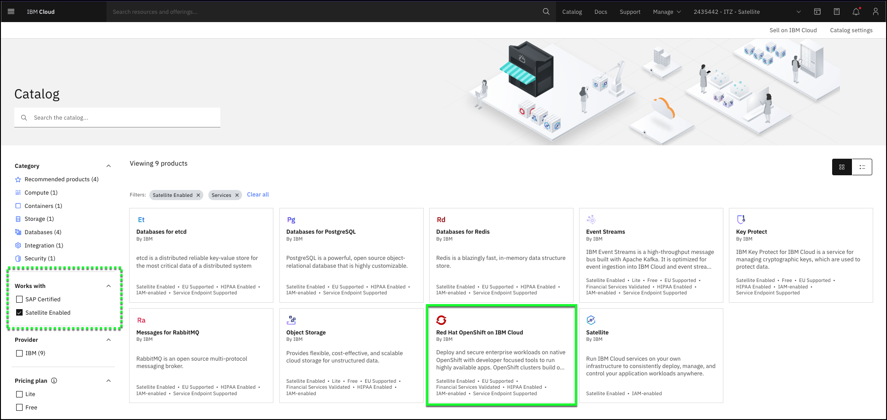
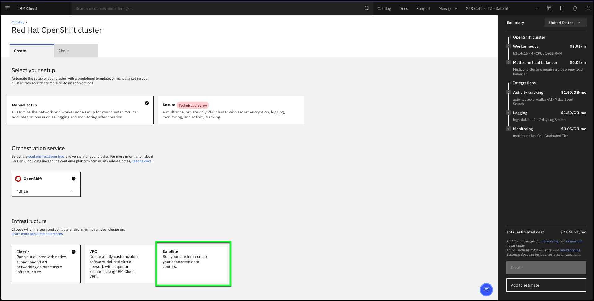
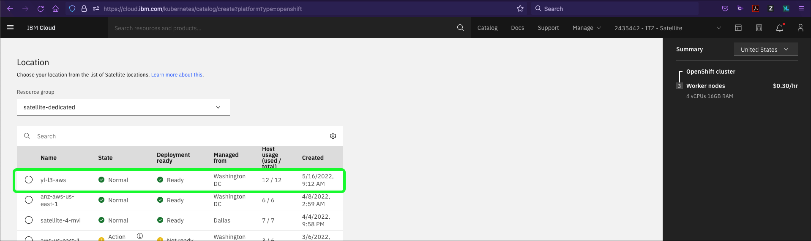
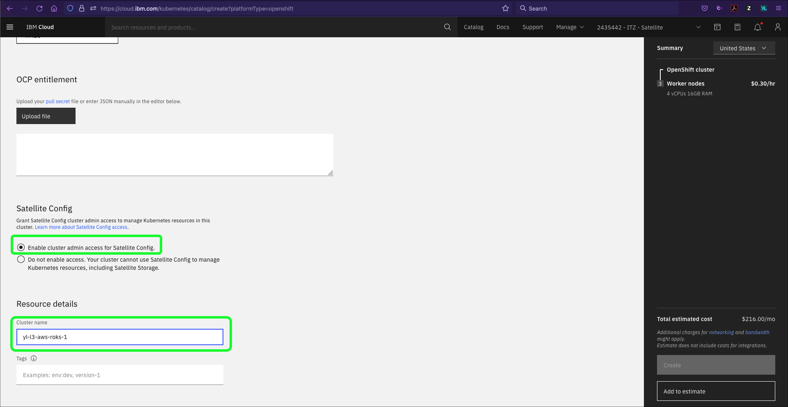
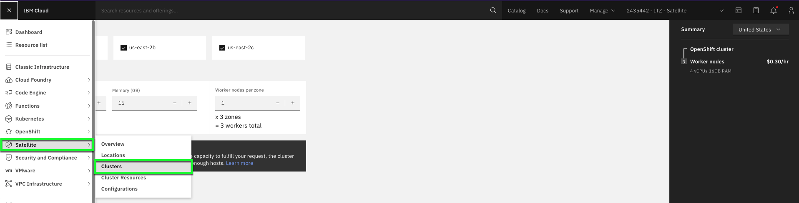
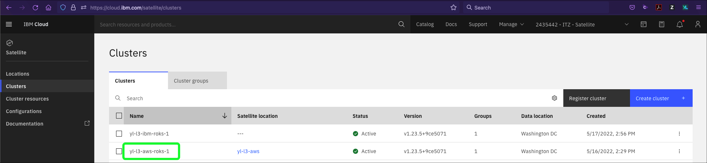
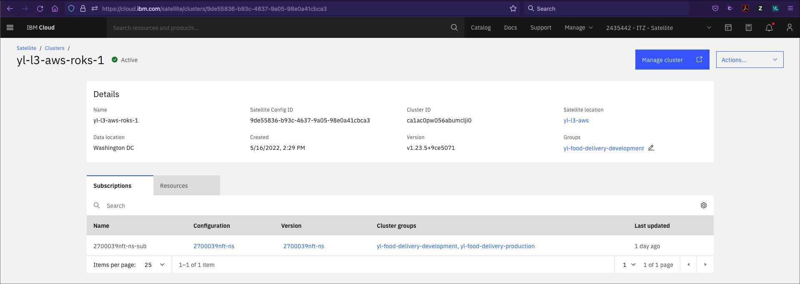

In this chapter you will be presented with both a video and two "click-thru" demonstration that shows an IBM Cloud Satellite Location being created in AWS.  You are strongly encouraged to watch the video first.  Then execute the click-thru demonstration and think about what you would say during while demonstrating each step to a client.

# Video demonstration

This video shows the provisioning of a Red Hat OpenShift on IBM Cloud to an IBM Cloud Satellite Location in AWS. The video has been edited to minimize the viewing time and does not reflect the actual provisioning time of an OpenShift cluster. The actual provisioning time (from clicking "Create" to the clusters being ready) will vary. When this video was created, it took approximately 50 minutes for the cluster to be provisioned in the Satellite location in AWS.

Use this video to understand the talking points you can use with a client when describing the provisioning process.

**Note:** If the video appears blurry, click the fullscreen  or  icon.

# Click-thru demonstrations

Now, give it a try.  Use the click-thru script below to step thru the demonstration. Now would be a great time to practice what you would say to a client if you were demonstrating the provisioning process. IBM sellers will need to do this as part of your Stand and Deliver to complete the IBM Cloud Satellite Level 3 badge.

!!! tip
    If you are not sure where to click, simply click anywhere on the screen and the spot to click next will be highlighted.

The first click-thru demonstration walks you through provisioning the OpenShift cluster with the minimum number of required hosts: 3.  In the second click-thru demonstration, you will see how additional hosts can easily be added using the IBM Cloud Portal.

1. Click the play button  to begin the demonstration.

   <iframe src="../../includes/ROKS-AWS-create-3node/index.html"  height="600" width="1350"></iframe>

2. Click the **Clusters** option in left pane.
3. Click the **Satellite** tile under the **Infrastructure** section.
4. Click the **Resource group** drop down menu.
5. Click the **satellite-dedicated** option.
6. Click the radio button for the **yl-l3-aws** entry in the Satellite Locations table.
7. Click the **4.9.28** selection under the OpenShift orchestration service pulldown menu.
8. Click the **4.10.9** version in the option menu.
9. Click the radio button to **Enable cluster admin access for Satellite Config**.
10. Click in the **Cluster name** entry field.
11. Click **Create**.

At this point the screen will refresh several times. Notice the changes in the node status tile. The actual provisioning process took approximately 35 minutes to complete.

Now learn how to add additional hosts to the OpenShift cluster.

1. Click the play button  to begin the demonstration.

   <iframe src="../../includes/ROKS-AWS-add-nodes/index.html" width="600" height="1350"></iframe>

2. Click the **yl-l3-aws-roks-1** option in the **Clusters** table.
3. Click the **Manage cluster** button.
4. Click the **elipses**  icon for the default pool in the table.
5. Click the **Resize** option.
6. Click the **+** button for the **Worker nodes per zone**.
7. Click the **Resize** button.

At this point the screen will refresh several times. Notice the changes in the node status tile. The actual provisioning process takes approximately 15 minutes to complete.

# Practicing for a client demonstration

There are several approaches you can take in doing an actual demonstration of the provisioning process of a Satellite enabled IBM Cloud service.

1. Play the above video to the client. It includes both narration and annotations.
2. Use the video and provide your own narration to the video. You will want to pause the video at appropriate locations based upon your narration and any questions your client may have.
3. Use the click-thru demonstrations. Don't try to hide the fact this is a recorded demonstration, rather explain you are using it respect of the clients time as actually provisioning the environment takes about 50 minutes.
4. Alternatively, you could also do this demonstration using the IBM Cloud portal up to the point of clicking the "Create" button. Then switch to the already provisioned cluster and describe what took place during the provisioning process. This "baking show" approach shows all the steps, but avoids the delays that would be required to perform the provisioning of resources.

The steps below can be used as a guide for this style of demonstration. Note, the screen captures below utilize a different location and cluster than what you will have access to, however the instructions should align with what you will see in the IBM Cloud Portal using your IBM Tech Zone reservation.

1. Launch the IBM Cloud portal to the Satellite enabled catalog page: <a href="https://cloud.ibm.com/catalog?search=label%3Asatellite_enabled" target="_blank">https://cloud.ibm.com/catalog?search=label%3Asatellite_enabled</a>.

!!! tip
    The IBM Cloud Portal will be opened in a new browser tab. You need to switch between this tab and the new tab to accomplish many of the tasks. You may want to open the new tab in a new window and display both browser windows at the same time. You may need to disable pop-up blockers if you do not see the new tab. Also, Firefox and Safari browsers are recommended as the image quality of screen captures when viewed in Chrome are sub-optimum.

Sample dialog: The current catalog for IBM Cloud Satellite enabled services include IBM Cloud Databases like etcd, PostgreSQL, Redis, and RabbitMQ. In addition, IBM Event Streams is available and provides a high-throughput message bus with Apache Kafka. There is also IBM Key Protect for IBM Cloud for managing cryptographic keys for data protection. And we also support Red Hat OpenShift on IBM Cloud as well as Cloud Object Storage.

2. If you haven't already, change from your IBM Cloud account to the demonstration IBM Cloud account: **{{ account }}***.

!!! tip
    If your browser window is narrow, you may see this icon:  instead of the current account name as shown in the screen capture above.

3. Click the **Red Hat OpenShift on IBM Cloud** tile.

Sample dialog: For this demonstration, I'll show you how simple it is to deploy these Satellite enabled services. Red Hat OpenShift on IBM Cloud provides a managed container platform for running enterprise workloads in Kubernetes clusters. With OpenShift on IBM Cloud, you only need to focus on your applications and IBM will manage the platform.

4. Select the **Satellite** tile under the **Infrastructure** section.

Sample dialog: Red Hat OpenShift on IBM Cloud is support in the IBM Cloud classic and Virtual Private Cloud (VPC) environments, as well as Satellite.

5. In the **Location** section, select the **{{ aws.location }}** location in the table.

Sample dialog: Once I select Satellite, I just need to specify the IBM Cloud Satellite location where I want to deploy OpenShift. As a prerequisite, the Satellite Location will need hosts available for the deployment to succeed. As you will recall, when we created our Satellite Location, we provisioned 3 hosts for the control plane, and 9 hosts as worker nodes. I'll use those 9 hosts as my OpenShift worker nodes, place 3 in each of the 3 availability zones in our Satellite Location.

6. Change cluster name to {{ aws.cluster_name }}.

!!! info "Important"
    Once you specify a name, the **Create** button at the far right of the portal would typically be enabled. Since you do not have the appropriate permissions in this account to create a new cluster, the button remains disabled.  Now is the time to explain what happens if you were to click create.

Sample dialog: That is all the information that is required. Now just click create and let the automated provisioning begin. When I originally provisioned the OpenShift environment in the AWS Satellite Location, it took about 50 minutes for the entire installation and configuration of the OpenShift cluster. Let us now look at an already provisioned cluster in our Satellite location.

7. Click the  menu and select **Satellite->Clusters**.

8. Click **{{ aws.cluster_name }}** in the **Clusters** table.

Sample dialog: Here you see the cluster we provisioned and the cluster's current status.

9. Time to wrap up this part of the demonstration.

Sample dialog: We can retrieve the details of the cluster and manage it using the IBM Cloud portal as well as the OpenShift web console. From a Red Hat OpenShift on IBM Cloud perspective, this cluster is just like any other Red Hat OpenShift on IBM Cloud cluster running in IBM Cloud.
