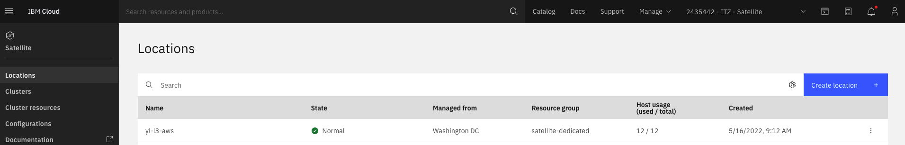

A Satellite Location is a representation of an environment in a client's choice of infrastructure, such as an on-premises data center or public cloud.

Creating a Satellite Location can be achieved through the IBM Cloud Portal, via the IBM Cloud Satellite command line interfaces or application programming interfaces (APIs). You create the location using at least three separate network zones in your infrastructure environment and attach host machines  across these zones to the Satellite Location. For other public cloud providers, IBM Cloud Satellite provides automation via <a href="https://cloud.ibm.com/docs/schematics?topic=schematics-about-schematics" target="_blank">IBM Cloud Schematics</a> to set up the Location. For on-premises deployments, scripts are provided that will need to be executed on each of the target host machines.

You can access the Satellite Locations directly in IBM Cloud Portal through this link: <a href="https://cloud.ibm.com/satellite/locations" target="_blank">https://cloud.ibm.com/satellite/locations</a> Below is a screen capture of the IBM Cloud Portal Satellite Locations page with a single Location defined. **Note:** the physical location of the Satellite Location is not an attribute of the Location. It is a good practice to use the physical location in the Satellite Location name or tags.

To learn more about Satellite Locations, refer to the Satellite Location product documentation: <a href="https://cloud.ibm.com/docs/satellite?topic=satellite-locations" target="_blank">https://cloud.ibm.com/docs/satellite?topic=satellite-locations</a>.

**Note:** there are many requirements associated with creating a Satellite Location including:

   - minimum host requirements
   - network latency between Satellite Location hosts and IBM Cloud data centers
